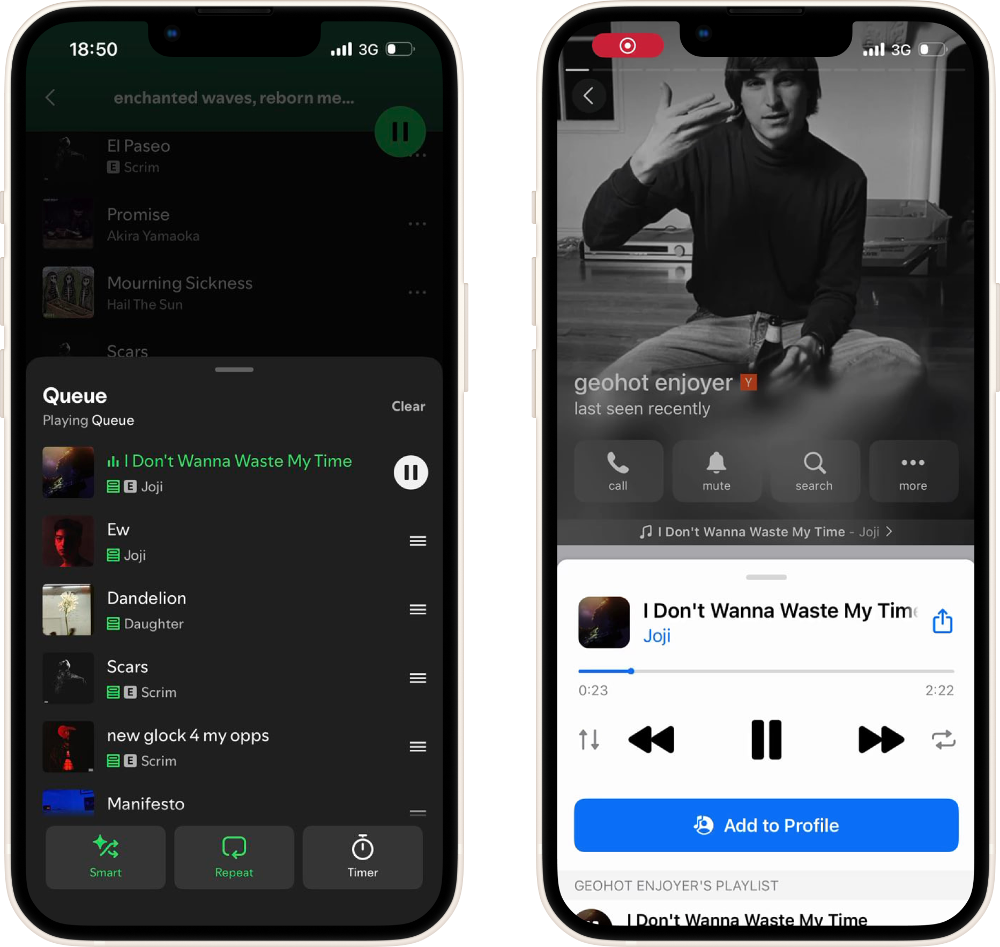

<p align="center">
  
</p>

> Sync your Spotify listening state into Telegram *Music on Profiles* — upload and pin tracks to your Telegram `Saved Messages` so anyone who sees your profile can see what you're sharing.

---

## Features

* Sync currently playing / saved tracks from Spotify to Telegram Profiles (Saved Messages).
* Pin synced tracks in Telegram; unpinning removes them from the profile.
* Uses a rolling cache of tracks — old tracks are automatically removed once the cache window advances.
* Supports using an existing Spotify refresh token (optional) so you can run the container on remote machines without a browser.
* Works with either a Telethon session file or a Telegram `tdata` folder (desktop Telegram data).

---

## Screenshot / Visual

<p align="center">
  
</p>

*(left: Spotify, right: Telegram — shows how the sync flows)*

---

## Quick start — Docker

Run the image from Docker Hub (recommended):

```bash
docker run -d \
  --name spotify-telegram-sync \
  -p 7000:7000 \
  -v /root/session.session:/app/session.session \
  -e SPOTIFY_CLIENT_SECRET="<YOUR_SPOTIFY_CLIENT_SECRET>" \
  -e SPOTIFY_CLIENT_ID="<YOUR_SPOTIFY_CLIENT_ID>" \
  -e SPOTIFY_REDIRECT_URI="http://127.0.0.1:7000/callback" \
  -e SPOTIFY_SCOPE="user-read-currently-playing" \
  -e SPOTIFY_REFRESH_TOKEN="<OPTIONAL_REFRESH_TOKEN>" \
  -e TELEGRAM_API_ID="<YOUR_TELEGRAM_API_ID>" \
  -e TELEGRAM_API_HASH="<YOUR_TELEGRAM_API_HASH>" \
  -e TRACKS_CACHE_SIZE=20 \
  -e TRACKS_BACKEND=spotdl_track_backend.SpotdlTrackBackend \
  -e CLEAN_TRACKS=True \
  therepanic/spotify-telegram-sync:latest
```

> **Note:** The command above uses placeholders. Do **not** commit or publish your actual `SPOTIFY_CLIENT_SECRET`, `SPOTIFY_CLIENT_ID`, `TELEGRAM_API_HASH`, or refresh tokens. Store sensitive values securely.

If you prefer to build locally:

```bash
# from project root
docker build -t spotify-telegram-sync:latest .
# then run the same docker run command (replace image name)
```

---

## Environment variables / configuration

| Variable                | Required |                  Default                  | Description                                                                                                    |
| ----------------------- | :------: | :---------------------------------------: | -------------------------------------------------------------------------------------------------------------- |
| `SPOTIFY_CLIENT_SECRET` |    Yes   |                     —                     | Spotify app client secret (from [https://developer.spotify.com/dashboard](https://developer.spotify.com/dashboard)). |
| `SPOTIFY_CLIENT_ID`     |    Yes   |                     —                     | Spotify app client id.                                                                                         |
| `SPOTIFY_REDIRECT_URI`  |    Yes   |      —     | Redirect URI registered in Spotify app.                                                                        |
| `SPOTIFY_SCOPE`         |    No    |       `user-read-currently-playing`       | Spotify scopes. Only `user-read-currently-playing` is required by default.                                     |
| `SPOTIFY_REFRESH_TOKEN` |    No    |                     —                     | Optional. If you already have a refresh token you can provide it to avoid manual browser login on remote machines. |
| `TELEGRAM_API_ID`       |    Yes   |                     —                     | Telegram API ID (create at [https://my.telegram.org/apps](https://my.telegram.org/apps)).                      |
| `TELEGRAM_API_HASH`     |    Yes   |                     —                     | Telegram API hash (from same place).                                                                           |
| `TRACKS_CACHE_SIZE`     |    No    |                    `20`                   | Number of most-recent tracks to keep pinned in Telegram. Older tracks are automatically removed.               |
| `TRACKS_BACKEND`        |    No    | `spotdl_track_backend.SpotdlTrackBackend` | Backend used to fetch/download tracks.                     |
| `CLEAN_TRACKS` | No | `True` | If `True`, tracks are removed from Telegram when the Spotify session ends. |

### Track backends

`TRACKS_BACKEND` controls where track audio and metadata are obtained from. Two backends are supported:

* `spotdl_track_backend.SpotdlTrackBackend` — **default**. Uses `spotdl` logic to locate and download audio for the requested Spotify track.
* `zero_track_backend.ZeroTrackBackend` — **fallback**. If no backend can find/download the actual audio, this backend uploads a message to Telegram containing the track metadata and cover art but **no audio** (the uploaded track will have 0 seconds duration).

### Session volume (Telegram auth)

You **must** provide a Telegram session. Two supported ways:

* Telethon session file (recommended):

  ```text
  -v /root/session.session:/app/session.session
  ```

* `tdata` folder from your Desktop Telegram installation (Opentele will convert it to a Telethon session automatically):

  ```text
  -v /root/tdata:/app/tdata
  ```

If neither is present, the container will walk you through the auth flow on first run (it depends on Telethon/opentele capabilities).

---

## Auth / obtaining a Spotify refresh token

1. Create a Spotify App at: [https://developer.spotify.com/dashboard](https://developer.spotify.com/dashboard) and copy `CLIENT_ID`, `CLIENT_SECRET` and set a `REDIRECT_URI` (e.g. `http://127.0.0.1:7000/callback`).
2. Create a Telegram app at: [https://my.telegram.org/apps](https://my.telegram.org/apps) and copy `API_ID` and `API_HASH`.
3. Start the container. Open `http://<HOST>:7000/auth` in your browser and follow the Spotify authorization flow.
4. Spotify will redirect to the callback you registered; after authorization the container logs will include the `refresh_token` (if you need one to run headlessly, copy it from the logs and set `SPOTIFY_REFRESH_TOKEN` in your run command on the remote machine).

> If you already have a valid refresh token you can skip the web flow and set `SPOTIFY_REFRESH_TOKEN` before starting.

---

## How it works (high level)

1. The service reads your Spotify playback / currently playing via the Web API (`spotipy`).
2. For tracks that should be shown, the configured backend (default: `spotdl`) prepares a track file or uploadable content.
3. The track is uploaded to your Telegram `Saved Messages` and pinned. When a track falls out of the cache window or is unpinned/removed, the service deletes it from `Saved Messages`.

This gives the visual effect of "Music on Profiles" — tracks remain visible while they are inside the configured cache window.

---

## Troubleshooting

* **No Telegram session / auth fails**: ensure `session.session` or `tdata` is correctly mounted and readable by the container. Check container logs for Telethon errors.
* **Spotify auth redirect fails**: confirm `SPOTIFY_REDIRECT_URI` exactly matches the redirect in your Spotify app settings.
* **No refresh token in logs**: re-run the `/auth` flow and watch the container logs carefully after completing the browser authorization; the refresh token is printed once.
* **Tracks not uploaded**: check the `TRACKS_BACKEND` configuration and ensure `spotdl` dependencies are present in the image (they are in the default image). Also verify network access.

---

## Development & Contributing

Contributions are welcome. Open an issue or a pull request with a clear description of the change. If you add backends or make changes to defaults, please update this README.

---

## License

This project is Unlicensed.